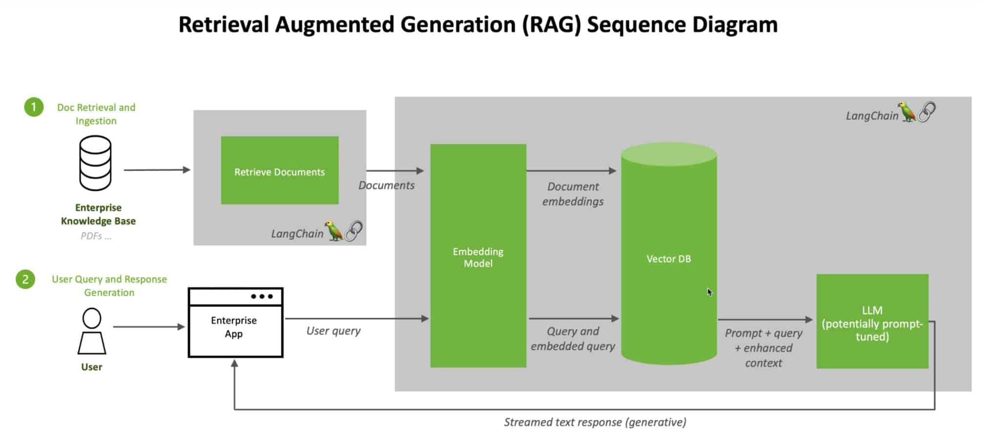

# Retrieval-Augmented Generation (RAG)

## 概要
- **Retrieval-Augmented Generation (RAG)**: 情報検索と生成の2つのAI技術を組み合わせたハイブリッドモデル。
- RAGは、外部データソースを統合することで、**言語モデル**の精度と文脈に沿った応答生成を向上させる。

## RAGの仕組み


> https://blogs.nvidia.co.jp/2023/11/17/what-is-retrieval-augmented-generation/

1. **検索 (Retrieval)**: 
   - RAGは外部の知識ベース（例: データベースやドキュメントストア）を利用して、関連する情報を検索する。
   - これにより、生成モデルが多様な情報源から事実に基づくデータで補強される。

2. **生成 (Generation)**:
   - 検索した関連文書や情報を基に、生成モデルが一貫性のある文脈に適した応答を作成する。
   - これにより、事実に基づきながらも自然な言語表現が可能になる。

## 主な利点
- **精度の向上**: 外部の最新データを基に応答を生成するため、従来の生成モデルで見られる「ハルシネーション」の問題を軽減する。
- **スケーラビリティ**: 幅広い知識ベースに対応し、多くのドメインにわたってスケール可能。
- **カスタマイズ性**: RAGモデルは特定のデータセットに合わせて調整でき、ニッチなアプリケーションでの性能を向上させる。

## 主な応用
- **チャットボット**: よりインテリジェントで情報豊富な対話型エージェントを作成するために使用される。
- **検索エンジン**: より関連性の高い検索結果や応答を生成するのに役立つ。
- **ナレッジ管理**: データが頻繁に更新されるダイナミックな知識ベースに有用。

## NVIDIAの役割
- NVIDIAは、**GPU加速環境**でRAGモデルの最適化に注力しており、エンタープライズおよび研究分野でのパフォーマンスと効率を向上させている。


# RAG Chatbotの実装

このガイドでは、NVIDIA の Generative AI Examples リポジトリにある RAG チャットボットを展開する
## Step 1: Clone the Repository

Generative AI Examplesリポジトリをクローンすることから始める：

```bash
git clone https://github.com/NVIDIA/GenerativeAIExamples.git -b v0.7.0
cd GenerativeAIExamples
```
## Step 2: Set Up a Virtual Environment
依存関係をインストールするための仮想環境を作成し、アクティブ化する：
```bash
python3 -m virtualenv genai0.7
source genai0.7/bin/activate
```

## Step3: Install Dependencies
サンプルに必要なパッケージをインストールする：
```bash
pip install -r examples/5_mins_rag_no_gpu/requirements.txt
```

## Step 4: Generate an API Key
モデルを使用するには、NVIDIAからのAPIキーが必要となる。 キーの入手先：https://build.nvidia.com/mistralai/mixtral-8x7b-instruct
```bash
export NVIDIA_API_KEY="PASTE_API_KEY_HERE"
```

## Step 5: Run the Example
Streamlitを使用してRAGチャットボットのサンプルを起動する：
```bash
streamlit run examples/5_mins_rag_no_gpu/main.py
```

## Step 6: Test the Deployment
ウェブ・ブラウザで http://localhost:8501/ にアクセスして、デプロイされたサンプルをテストする。
